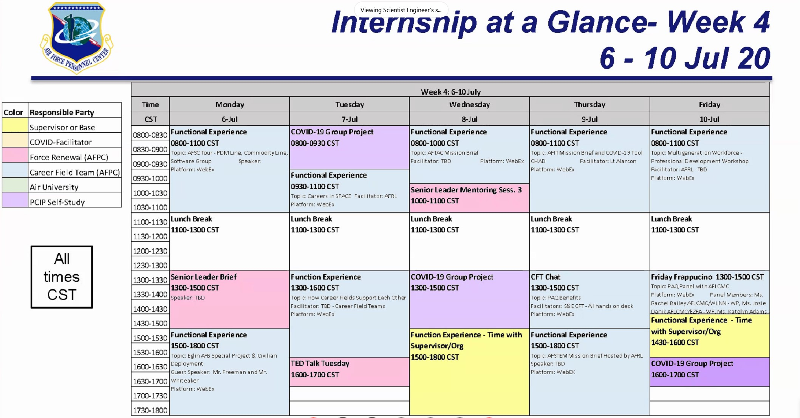

# Day 001: Teleworking & Legacy Project

## What I did

1. Reviewed documents in Maj. Wolfe's Email
2. Complete telework training: roleplaying.

## Teleworking

1. Talk openly about frequent monitoring & brainstorm ideas that work for both parties.
2. I can provide evidence that I'm a top-level performer.
3. Explain how important it is to remember teleworkers.
4. Define details of telework arrangement & place them in writing.

### Success Factors

* Managers and teleworkers define details of telework arrangement early and revisit them as often as needed. Telework agreements must be in writing.
* Managers and teleworkers take steps to ensure that telework works for customers, coworkers, and other key staff to ensure seamless coverage of work-related responsibilities.
* The appropriate technology is available to support tasks assigned to teleworkers.
* Ongoing and effective communication among management, teleworkers, customers, and coworkers is a priority for everyone.

### Desired Telework Skills

#### Concerns

* Impact on career, assignments, and promotions.
* Uncomfortable working away from coworkers?

#### Good Habits

* Work with minimal direct supervision
* Good planning skills.
* Meet schedules and deadlines.
* Effective Communication

#### Good Communication

* Avoid leaving manager with problems they have to work through.
* Empathize with your manager.
* Focus on telework's positive effects.
* Be flexible about teleworking arrangements.

### Skills and Processes

When you approach your manager about telework, you should consider the following:

* Why you want to telework
* How you think your teleworking will benefit your office and the agency
* Types of tasks you can complete while teleworking
* How you will communicate with your manager, coworkers, and customers
* How your manager will know you are being productive

In addition to those that were listed in the activity, you should also consider:

* Your proposed telework location
* Number of days per week you propose to telework
* Your personal work habits that will help you be a successful teleworker
* Space and equipment available

#### Telework Agreement

Make sure to include:

* Work schedule
* Communication avenues.
* Performance objectives.
* Job tasks

#### Negotiation Process

* Familiarizing yourself with the organizations agreements.
* Reiterating performance goals already for your job.
* Determine equipment, software, and other requirements.

#### Technology Concerns

* Data security
* Compatibility with office technology

#### Taylor Your Communication

* How often should I communicate with you?
* Check in daily with managers or less frequently.
* Choose which medium works best.

#### Communication Plans

* I realize it's up to me to let them know I'm approachable and available.
* Call them. Share your office and cell phone number.
* Make them feel comfortable and approachable
* Ask: "What do you think?"


Keep the lines of communication open by reaching out to my manager frequently.


#### Earning Manager's Trust

* Doing your best work
* Completing assignments on time.
* Pitch into help when the pressure is on.
* Offer new ideas.
* Volunteer for projects.
* Keep your supervisor informed about what you're working on.
* Keep supervisor informed on what you've accomplished.

### Telework Related Topics

#### COOP

* COOP stands for Community of operations
* A COOP Plan is required in every federal executive branch.
* It allows employees to maintain agency functions from an alternate location.

#### Pandemic

* Helps agencies function during disasters and emergencies.
* Strategic response to a official declaration of a public health emergency.
* Keeps face-to-face contact to a minimum.

#### Unscheduled Telework

* Keep a current telework agreement on file.
* Understand your manager's expectations.
* Make sure systems are tested and functional. 

### Certificate!

## Legacy Project

* Open Pose generates a skeleton over a person in the camera.
* Instead of an overlay.
* Some kind of 3D Model.
* The legacy kids haven't started much. They're learning C\# and did some blender tutorials.

### My Role

* Learn it alongside them.
* We're just here to assist them with other questions.
* Most of the summer, usually it ends the first week of August.

### Daily Meeting

* Checks to see what they've been doing.

## VPCIP S&E Welcome

### Shandra Bates

* Introduced Kristen Baldwin
* Attendance, put your name as `Mike Chase, Wright-Patterson AFB`

### Introduction: Kristen J. Baldwin

Deputy assistant secretary of the Air Force for Science, Technology, and Engineering.

Developmental planning, civilian science. She oversees the Air Force science and technology outreach.

### Background

* Went to school to be an engineer.
* Lived 45 minutes away from an engineering center.
* She's from New Jersey.
* She studied mechanical engineering and minored in HVIC systems.

### Career in Science & Engineering

* The world's largest singular organization of science and technology.
* Laboratory, international, testing, operational
* Competitiveness
  * Long-term national security
  * Economic security of our nation.
  * We must remain a global leader in technology & capability.
* We have partnerships with NASA, homeland security. There are many opportunities to partner with private industry, startups? \(really?\), and other parts of the defense/financial sectors.
* We have super cool defensive sensor initiatives. STEM is needed to make sure we're making the most rapid adoption of equipment into our systems.

### Developments Today

* **Rapid Capability Development:** Produce more and more, faster and faster.
* 2.8 Billion/year in funding.

#### Skyborg

* Autonomous vehicles at a smaller cost.
  * We can make them less safe, which decreases cost.
  * We can take more risks.

#### Real Time?

* Call out that target & continuously monitor targets and the operation environment.
* React, communicate, and change the mission while it's executed.
* **Machine learning!**

#### Virtual Prototypes

* Craft full engineering design artifacts.
* We can test them before we build them. 

#### Advanced 3D Printing

* Adopting those types of technologies and designs
* Lighter weight, more available materials that are easier & faster to manufacture.

#### Software

* DOD isn't the most _agile_ software developer.
* We're transforming engineering software to be more secure. 

### Technological Rigor

#### Safety

* They must last a long time
* They must be reliable over time
* They must be safe.

### Career

* 95% of science and engineering are civilians.
* _How do you get selected for executive service?_
* She's been able to find great mentors and managers.
* Lots of opportunity for visibility. We value the ability to share & broaden experiences.

### Q/A

#### Switching Disciplines

* You'll understand which direction you want to go.
  * Speak to your mentors and colleagues?
* Go for additional study or education?
* She chose those positions after 10 years and the experiences helping her learn operational functions.
  * She got a systems management degree
  * Experience on leading project teams. 
* They like to rotate jobs every 3ish years. 

#### What to do as an intern now!

* Engage, where you can, with people in your programs.
* Engage with the people we're going to meet.

#### Quality characteristics, pivotal moments, and other advice

1. Communication
2. Get excited to do more. Volunteer & taking advantage of an opportunity to get on a team.
3. Empathize with different perspectives.

### Closing PCIP Logistics

* Q/A will primarily be used in the chat function.

#### Maxiflex

* We'll get the rest of the schedule today.
* We'll have some self-paced work and mandatory times too.

#### Paychecks

* First pay check is 26 June 2020
* We might get paid the next pay period.

#### 6-Week Schedule

* We standardized into standard time.

* All of this is in Central Standard Time

* Missed week 3 because of internet problems. Rats.

