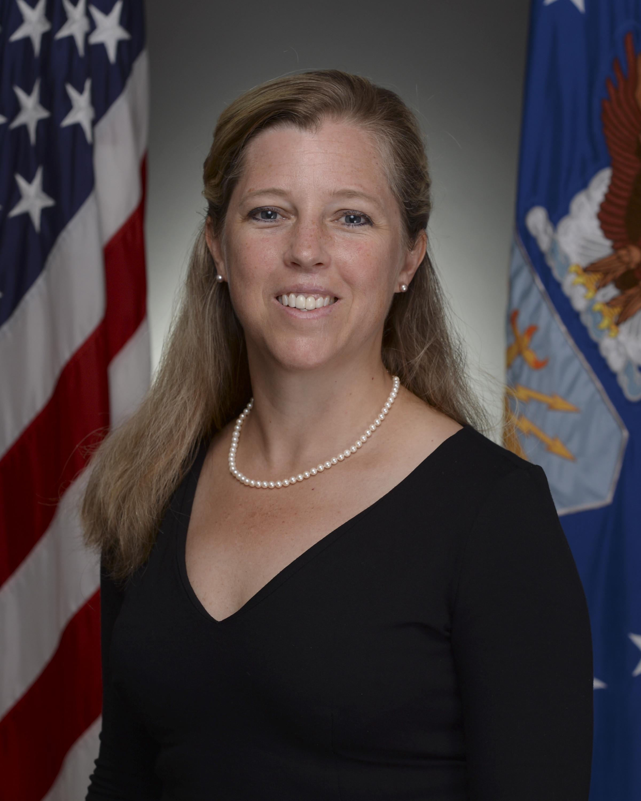

# Day 002: Drum Cafe

## Virtual Meeting

* Brandon, Ethan. Jacob
* Learning C\# still; entirely virtual using Open Pose.
* I told them to bother me with any questions they have. Maybe I can go through tutorials with them.

## Drum Cafe

* We hired some hype-men.
* They led a virtual drumming.
* Some people voted me MVP for bringing on a cowbell when they asked people to play.
* It was silly, but it really brought us together. 

## Speaker: [Gwen DeFilippi](https://www.af.mil/About-Us/Biographies/Display/Article/1626733/gwendolyn-r-defilippi/)

> Gwendolyn R. DeFilippi, a member of the Senior Executive Service, is the Assistant Deputy Chief of Staff for Manpower, Personnel and Services, Headquarters U.S. Air Force, Arlington, Virginia. She serves as principal assistant to the Air Force Deputy Chief of Staff for Manpower, Personnel and Services. She is responsible for comprehensive plans and policies covering all life cycles of military and civilian personnel management, including military end strength and civilian work-year execution, education and training, compensation and resource allocation and the delivery of fully-qualified, ready Airmen for the joint warfighter while also meeting all the needs of our Airmen and their families. She oversees the execution and programming of the Manpower, Personnel and Services portfolio with an annual $47 billion personnel budget for 685,000 military and civilian total force Airmen. As Chair of the Civilian Force Development Panel, she plans, directs and evaluates programs to ensure a qualified, productive and well-maintained work force of over 183,000 civilian employees.
>
> Ms. DeFilippi was appointed to the Senior Executive Service in 2010. Her previous executive positions include Chief of Staff to the Acting Secretary of the Army, Deputy Assistant Secretary of the Army for Civilian Personnel, Deputy Assistant Secretary of the Army for Force Management, Manpower and Resources and Director of the Army’s Civilian Senior Leader Management Office. She has held a variety of positions within the Human Resources community and also is a member of the Air Force Reserve.

### Professionalism

* Dress for work.
* Be professional at life and on social media.
* Be flexible and positive.

### Generational Gaps

* We like to text, but we should call more.
* We wear Air Pods and it looks rude because it looks like we're trying to tune them out.

### Meeting New People

* Ask to join meetings if they haven't included you.
* Ask people what they're doing.
* Ask for people's advice. _It makes them feel good_ _and important._

### Questions to ask your new boss

1. What is the mission of the organization?
2. How does what I am responsible for fit in?
3. What are your priorities? _\(and why are they asking me to do certain tasks?\)_
4. What is your biggest challenge? _\(helps you determine why they act the way they do\)_
5. What keeps you up at night?
6. What are your future plans for the office?
7. What's on your mind beyond the day-to-day operations?
8. What are your pet peeves?
9. What are your expectations of me? _\(be direct and ask\)_.

* Look at their biographies.

### Networking

* Share things that didn't go well with your network because then, you can learn from them.

## Logistics Interlude

* When asking questions: name, base, career field, area of study. 
  * Hello, I'm Mike Chase from Wright-Patterson Air Force Base
  * I study computer science and want to work as a software developer.

## The Office

Link to: [Skit](https://www.youtube.com/watch?v=i7y2WqJdhr0&feature=youtu.be)

### Audit: Ms. Sherrie Daughtery

### Civil Engineer Mr. Brian VanDelist

* Civil engineer career field. 
* Responsible for 

### Communications and Informations Ms. Vina Perlow

* 8 Years. Training and command.

### Contracting: Mr. Kyle Braunlich

* Contracting field team.
* Played Dwight.
* 11 Year at the Air Force
* Contracting officer, agreements, 

### Financial Management: Ms. Mary Mabron

* Worked in the test wing.
* They call colors money. 

### Force Support: Ms. Susan Long

### Logistics: Ms. Felicia Sargent

* 23 years active duty \| 4 years as a civil servant.
* Was a maintenance leason. 

### OSI Mr. Steven Kukovich

* Special agent
* Investigator at the Airforce academy.
* They do criminal investigations. They do it all: there's counter intelligence, fraud.

### Program Management: Mr. Aaron Brown

### Science and Engineering: Ms. Shandra Bates

* Hill Airforce doing supply stuff?
* F-15 landing engineer.
* Came in as a smart scholar.

## Past PCIP Interns

### Science & Engineering: Joshua Neeley

* Don't wait to contact your mentor _**about hacking and IT!**_

### Logistics: Harvey Moody PCIP

* Go ask other interns what they're working on, attend some of their meetings and do things!

### Force Support Career Field: Brenna Cyr

### One Week

* Get to know your other interns, grab lunch, and hang out after work.

## Security OSI

With Mr. Steve K.

### Air Force Affiliation

* Contact your local ASI for tracking or bigger threats.

### Targets

* Lots of people will are asking me for military intelligence

### Terrorism

* Islamic state hacking division.
* They would try to cause threats by having kill lists. Name, photo, and address of airmen.
* Check your online profile and hide more information.

### Countermeasures

* Remove personal information, addresses, and phone numbers. 
* Don't wear security badges out of work. Don't take pictures showing security badges.

## STEM Breakout Session

Led by Lita Hamilton

### PAQ Program

Purpose: recruit and develop college graduates into Air Force Civilian Scientists and Engineers

* You must have a 2.95 GPA. You must be a full-time student.

#### Incentives

* Student loan reimbursement up to 30K.
  * It must be a federal student loan.
* Paid move to employment location \(if you're living &gt; 50 miles from base\).
* Funded graduate degree with a full salary \(3-year PAQ Program\)
  * 12 months for full-time in-residence class attendance.
* Recruitment bonus of up to 75% of your starting salary for most positions.
* https://dodmou.com has agreements with universities for payment.
* You'll start 2 months after graduation AND
* No later than 120 days after graduation.
* It's first-in-first-out. You and your supervisor have to submit as early as possible. 
* First year, you're a GS-07.
* Second year, you're a GS-09, but you're a student.
* When you are placed, you are a GS-12.

### Recruitment Incentive

* 75%-100% of your salary for most series.

