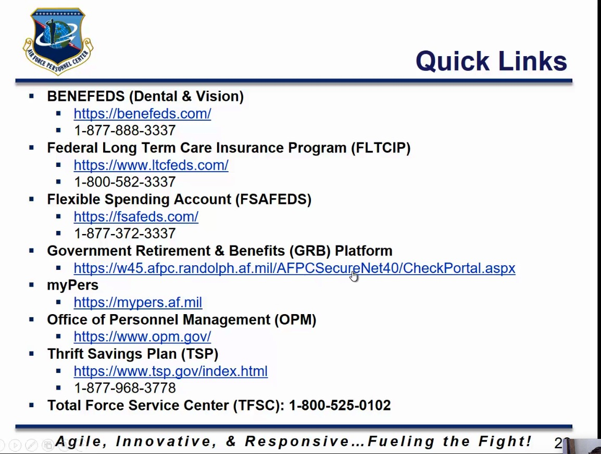

# Day 004: Benefits

## Speaker: Kimberly Tony \| Senior Leader

* She was very professional
* Very caring
* Very, very inspirational. She almost had me sold on joining the Air Force.

## Benefits

### FEHB Federal Employees Health Benefit

* OPM.gov insurance has lots of information about the FEHB plans in our state.
* If you don't enroll in your first 60 day, you have to wait until
  * The next open season \(2nd Monday November-December\) to enroll in FEHB
  * It goes into effect the following Janruary
  * Qualifying life events \(QLE\): Married, divorce, passing of a loved one
* _**You can stop, start, or change elections via the GRB Platform**_.
  * I would have to call in to grab these.

### Types of Coverage

* Self only
* Self and family
* Self plus one.

### Premiums

* Full time employees pay approximately 25% of the premiums.
* The government pays the difference.
* Part-time employee's premiums are prorated based on bi-weekly tour of duty.
* If we are enrolled in Premium Conversion \(automatically\), we do not have to pay tax on it.

### Temporary Continuation of Coverage \(TCC\)

* It's available to separating employees.
* You will have to pay the full health-insurance premium.
* Very few employees use it.

### Federal Employee Group Life Insurance \(FEGLI\)

* Volunarily. You may elect to waive, cancel, or reduce at anytime.
* You must elect for optional insurance within your first 60 days

#### Types of Coverage

* Basic: base salary rounded to the next $1,000 + additional $2,000
* Option A: An additional 10,000
* Option B: Up to 5 multiples of your base salary
* Option C: Family coverage, up to 5 multiples of salary. \(Children, max is $12,500\)

### Federal Employees Dental & Vision Insurance Plan \(FEDVIP\)

* Coverage is not automatic
* Employee pays 100% of the premium.
* You do not have to be enrolled in FEHB

### Federal Flexible Spending?

* We went too fast.

### Federal Long Term Care Insurance Program \(FLTCIP\)

This helps pay for services such as:

1. Chronic care
2. Home care
3. Nursing Homes
4. Assisted Living Facilities

It provides coverage and benefits to assist you in your everyday life when you are no longer capable of providing care for yourself such as:

1. Eating
2. Bathing
3. Dressing

* It's not disability or short-term medical care
* Cost varies by ave. 

### Beneficiary Forms

The precedence are set by law, but you can change it. By default, this will trump a will.

1. Spouse
2. Children in equal shares
3. Parents in equal shares
4. Next-of-kin
5. Estate or will you've established.

### I gave up

This stuff is complicated.

