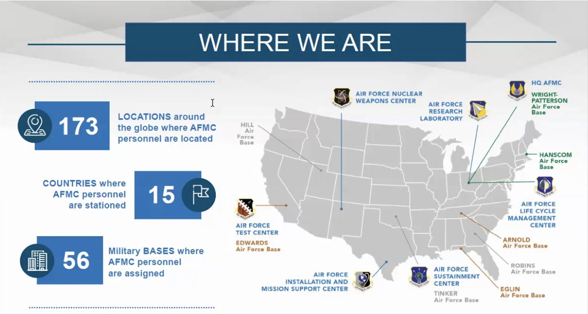

# Day 005: AMFC

## AFMC Speaker: Gail Forest

### Gail Forest Background

* Director of Engineering and technical management
* Headquarters Air Force Material Command
* She's equivalent to a 2-star general.
* She says **we can reach out** to her!

> Gail P. Forest, a member of the Senior Executive Service, is Director of Engineering and Technical Management, Headquarters Air Force Materiel Command, Wright-Patterson Air Force Base, Ohio.  Ms. Forest is the Senior Technical Advisor to the Commander in support of the command’s mission to deliver war-winning technology, acquisition, test, and sustainment expeditionary capabilities to the warfighter.  She leads the development and implementation of engineering policies and practices spanning science and technology, research, development, test and evaluation, sustainment focused on achieving fleet operational safety, suitability and effectiveness.  Ms. Forest also directs development of new initiatives designed to improve the recruitment and career management of the command’s 12,000 military and civilian scientists and engineers.
>
>  Ms. Forest began her career as a manufacturing engineer with Buick Motor Division, General Motors Corporation. In 1982, she entered federal civil service as an engineer in the Maintenance Directorate at Headquarters Air Force Logistics Command. She has held numerous engineering, logistics, and acquisition program management positions.  
>   
> Prior to her current assignment, Ms. Forest was the Director for Information Dominance Programs, Office of the Assistant Secretary of the Air Force for Acquisition, Washington, D.C. She was responsible for planning and programming all acquisition and modernization activities for Air Force command, control, communications, computers, intelligence, surveillance and reconnaissance programs.

### Mission and Vision

### What They Do

### Huge Budget

* They also run the test pilot school
* Also run medical schools.

### Run Tons Science Goals

### Where They're Located

### Air Force Research Laboratory

* It's the Air Force's only division of creating new technologies.
* 45 different locations, including Wright-Patterson.
* Oversees critical research for the department of defense.

* As of yesterday, there was a change in command. Now, it's Gen. Heather Pringle.

### Nuclear Weapons Center

* It's in Kirkland Air Force Base in Nevada.

### Air Force Installation & Mission Support

## AFMC Panel

### Craig Erford


Went to UD for his masters! Works at Wright-Patterson.


* Air Force Research Labs
* Started at **Wright-Patt** as an engineer.
* He's going/went to the University of Dayton for his masters.
* He coaches high-school volleyball.

### Ms. Demica Ware

* Worked at Intel for a while.
* Bachelors of Science in Computer Engineering
* Went to the University of Dayton for Engineering Mangament and found out it wasn't for her.
* Go to school for something you're interested in, not what you're expected to.
* Also at **WPFAB**
* She was responsible for making sure simulators/emulators were free of malware.
* She went to University of Maryland to get her masters. It was the only masters authorized by the Air Force so she could get her masters program in cybersecurity.
  * She had to choose from a list of Universities.


She went to UD, but dropped out. 


### Adrienne Rice

* Working at the Air Force for 16 years.
* She has a 5 mo. year old baby.
* Background in biomedical engineering; acoustics branch.

## Logistics Interlude

### PCIP Stats

### Week 2

## Supervisor Phone Call

### Time and pay

* Starts on a Sunday, ends on the following Saturday
* Ends tomorrow on the 20th.
* Starts on the 21st to July 4th.

### New Employee Orientation

* Start on Tuesday
* It's a whole ton of information.

### Housing Update

* They just opened up this week; there's a couple people infected.
* The grill is working.

## 2nd Opinion

* They want us to think that the Air Force is a fun, cool place.
* Anna is only doing this for $21/hr. 
* Maybe I should go work for Facebook.
* You can get out when you're 40 and get some nice benefits.

## Friends Chat

* Anna Duricy and Evan Krimp

### Insurance Companies

* Insurance companies will never allow that to happen.
* States are passing reforms saying you don't have responsibility.
* Any waver you sign will not really hold up in court.

